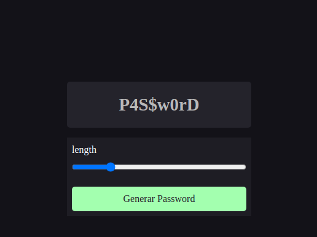

# Proyecto: Generador de passwords básico

## Descripción
Este reto ayudará a los estudiantes a fortalecer sus habilidades en JavaScript, específicamente en el uso de bucles for, manipulación de cadenas y funciones. El objetivo es crear un generador de contraseñas que permita a los usuarios seleccionar la longitud de la contraseña mediante un input tipo range y genere una contraseña aleatoria de la longitud seleccionada.

## Características
El Alumno debe ser capaz de:

- [ ] Manejo de ciclo for 
- [ ] Uso de funciones
- [ ] Uso de métodos de strings y concatenación

## Nota:
- El length y el input range solo es opcional, posiblemente: para alumnos más avanzados
